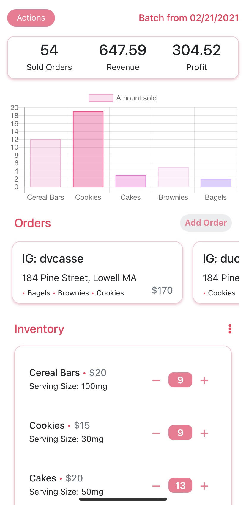
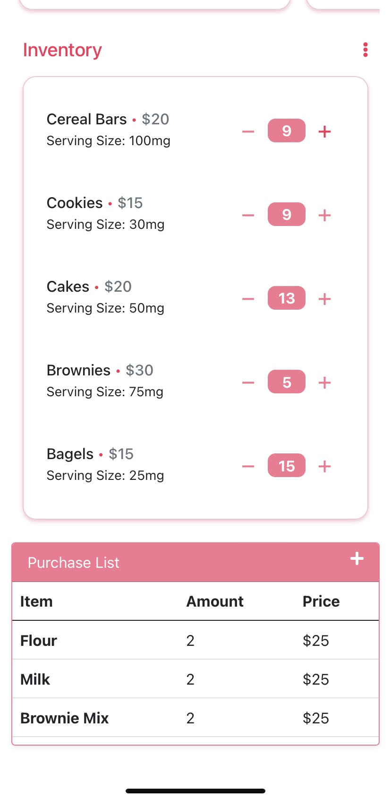
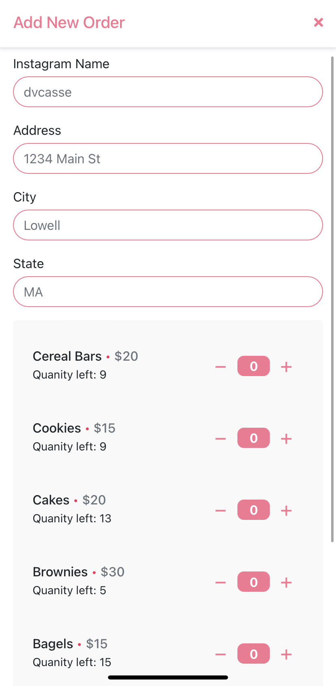

# HNH Bakery - Cisco Ducasse

[Link to visit app here.](https://hnhbakery.herokuapp.com/)

## Tech Stack

- React
- MySQL / Knex
- Node.js / Express.js
- Bootstrap / Sass

I have a friend who was running her business on pen & paper and was having a bit of a hard time keeping track of her services. I decided to make her a mobile-based dashboard that can keep track of her clients and her products. I thought it would be cool if she can visualize her top-selling products, an be able to try new things and visually see what works and what doesn't. She also streamlines her clients from Instagram, so it was a bit hard to keep track of who is getting what and when.

I'm using React as a frontend with Express.js serving routes and data from MySQL connected through Knex.js query builder. I also use different chart libaries (like react-chartjs & react-progress) to display information based off different products sold.

#### Images

#### Todos

- Possibly make a large-screen design. Will do if needed
- Create api that can keep track of longterm data
- Implement some sort of route-scheduler to showcase when and how to make deliveries.
